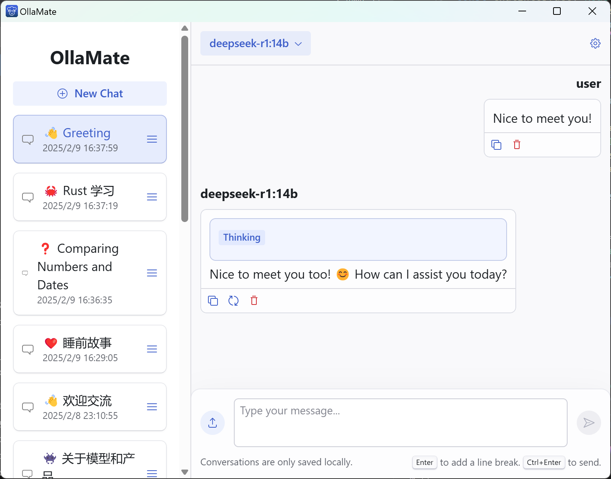

# OllaMate


Yet another Ollama chat client for any platform.

Made with [🦀 Tauri](https://tauri.app) + [▲ Next.js](https://nextjs.org) and ❤️.



## Features

- ✒️ Full Markdown & LaTeX support
- 📚 Supports multiple models
- 🎨 26 colorful themes
- ⚙️ Customizable model parameters offered by Ollama
- 🖥️ Cross-platform & light-weight

## Getting Started

```bash
npm install
```

- Start developing:

  ```bash
  npm tauri dev
  ```

- Build for production:

  ```bash
  npm tauri build
  ```
